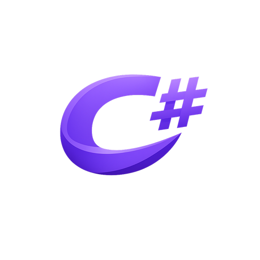

<div id="vssharp-logo" align="center">
    <br />
    
    <h1>VS Sharp</h1>
    <h3>A Free/Libre C# IDE built on VSCodium — Rider-style, zero proprietary lock-in</h3>
    <p><sub><i>VS Code's editor &nbsp;·&nbsp; JetBrains-style chrome &nbsp;·&nbsp; Roslyn LSP &nbsp;·&nbsp; Profile-based run/debug</i></sub></p>
    <br />
</div>

---

**VS Sharp** is a custom rebuild of [VSCodium](https://github.com/VSCodium/vscodium) (the FLOSS rebuild of Microsoft VS Code) tailored as a dedicated **C# / .NET IDE**. It pairs VS Code's editor with a Rider/Visual-Studio-class .NET workflow — Solution Explorer, multi-profile run/debug, JetBrains-style chrome — using only MIT-licensed sources.

It is **not** a from-scratch fork. We follow VSCodium's pattern: rebuild Microsoft's MIT-licensed `vscode` source with custom patches, branding, and bundled extensions. All customizations live in a separate `vssharp/` tree so upstream sync stays manageable.

---

## Why VS Sharp

C# / .NET development on VS Code today funnels users into Microsoft's proprietary **C# Dev Kit**, whose license restricts use to official VS Code builds. VS Sharp ships a 100% open-source alternative:

| You want… | VS Sharp gives you… |
|---|---|
| Roslyn-powered C# IntelliSense | **DotRush** LSP bundled as built-in (no marketplace install) |
| Rider-style Solution Explorer with `.sln` parsing | **VS Sharp Explorer** webview, JetBrains New UI icons |
| Run/Debug from `launchSettings.json` like Visual Studio | **VS Sharp Runner** — multi-profile, concurrent sessions |
| JetBrains visual identity without trademark assets | fogio New UI themes + product icons (MIT) |
| FLOSS-only stack, telemetry off | Inherited from VSCodium |
| Customize and rebrand for your own org | `apply-branding.sh` + `apply-logo.sh` |

---

## Features at a glance

### Solution Explorer (Rider-style, two-tab webview)

A custom webview panel that replaces VS Code's default file explorer. Two tabs in one container:

- **Solution tab** — parses `.sln` / `.slnx` directly (self-implemented, no MSBuild dependency). Renders:
  - Solution root with project count (e.g. `VN_MYCLUB sln · 43 projects`)
  - Solution folders nested as the `.sln` says
  - Projects with their type glyphs (Web / Library / Console, etc.)
  - Expand a project → list source files grouped by folder
  - `Properties/` and `wwwroot/` pinned to top of each project (matches Rider)
- **Files tab** — plain workspace tree (escape hatch when you need raw files outside the solution graph)
- **Eye toggle** — show/hide non-project files (bin, obj, .git, .DS_Store, dot-files, configurable `vssharp.explorer.hiddenPatterns`)
- **JetBrains New UI icons** — 186 file SVGs + 44 folder SVGs from `fogio-org/vscode-jetbrains-file-icon-theme` (MIT). Dark and light theme variants follow the workbench theme automatically
- **Context menu actions** — New File / Folder, Rename, Delete, Duplicate, Copy Relative/Absolute Path, Reveal in Finder, Open in Terminal, Manage NuGet Packages, Build / Clean / Restore / Run / Test (per-project)
- **Right-click on solution** — Add New Project, Add Existing Project, New Solution Folder, Run Multiple Projects, Publish, Properties

Implementation: `vssharp/extensions/vssharp-explorer/src/{sln-parser,csproj-parser,explorer-tree-provider,webview-provider}.ts` (each file < 200 LOC, modular).

### Profile-based Run / Debug (Rider / Visual Studio parity)

`VS Sharp Runner` reads every `Properties/launchSettings.json` in the workspace and surfaces every profile as a first-class action. No more `.vscode/launch.json` boilerplate for standard ASP.NET / .NET projects.

**Activity bar — "VS Sharp Run" panel**
- Hierarchy: **Project → Profile** tree view
- Each profile shows inline action buttons: ▶ run · 🐞 debug · ⏹ stop (state-aware: shows only ▶ when stopped, only ⏹ when running)
- Description line per profile shows live state: `▶ 3m · Development · http://localhost:5000`
- Tooltip (Markdown) shows command kind, applicationUrl, environment vars, working directory, session start time
- Icon color-coded:
  - star (purple) — profile selected as default for this project
  - circle (muted) — other profiles in the same project
  - play (green) — running session
  - bug (red) — debugging session
- Header actions: refresh / stop-all
- Project node shows count of running sessions

**Editor title bar**
- Two icons appear at top-right of any editor: ▶ and 🐞
- Click → detects the `.csproj` containing the focused file
- Resolves profile in this order:
  1. Profile last chosen for that project (per-project memory)
  2. First profile declared in `launchSettings.json`
  3. Globally selected profile (fallback when the file isn't in any project)

**Status bar**
- Live counter `▶ N running` shown on the left when any session is alive
- Click → QuickPick of running sessions to stop selectively

**Keybindings** (active when a profile is resolvable and not already in a debug session)
- `F5` — debug current file's project
- `Ctrl+F5` / `Cmd+F5` — run current file's project (no debugger)

**Concurrency model**
- One session per profile (clicking ▶ on an already-running profile warns "stop first")
- Multiple *different* profiles can run/debug simultaneously
- Each session gets its own dedicated terminal panel — output never gets interleaved
- Debug sessions launch via VS Code's debug API, attach DotRush debugger automatically for C#

**Concrete example**
```jsonc
// Properties/launchSettings.json
{
  "profiles": {
    "Main.API (Dev)": {
      "commandName": "Project",
      "launchUrl": "swagger",
      "applicationUrl": "https://localhost:7001",
      "environmentVariables": { "ASPNETCORE_ENVIRONMENT": "Development" }
    },
    "Main.API (Staging)": {
      "commandName": "Project",
      "applicationUrl": "https://localhost:7002",
      "environmentVariables": { "ASPNETCORE_ENVIRONMENT": "Staging" }
    }
  }
}
```
→ Both profiles appear in the VS Sharp Run tree. You can debug `Main.API (Dev)` and simultaneously run `Main.API (Staging)` to compare behavior across environments. Each opens its own terminal.

### DotRush bundled as built-in (no install step)

[DotRush](https://github.com/JaneySprings/DotRush) (MIT) ships pre-bundled — Roslyn workspace, IntelliSense, code actions, .NET debugger, all without any marketplace install or Microsoft account. Pinned at a known-good commit via `vssharp/dotrush.UPSTREAM.txt`. Local patches in `vssharp/dotrush.patches/` (e.g. `NU1903` security advisory demoted from build-blocker to warning).

### JetBrains-style chrome

- **JetBrains Mono font** as default `editor.fontFamily` (falls through to Menlo if not installed — `brew install --cask font-jetbrains-mono` to enable)
- **JetBrains color theme** (fogio, MIT) set as default for both dark and light
- **JetBrains product icons** (fogio, MIT) set as default — sidebar / activity bar / status bar glyphs in the Rider New UI style
- **Rider feel defaults** — line-height 1.5, breadcrumbs on, indent guides always, sticky scroll, tree indent 16px, single-click folder expand, custom title bar, auto-save 500ms, no minimap, font ligatures on, smooth caret animation. ~40 keys total registered via `configurationRegistry.registerDefaultConfigurations` so they sit at the lowest precedence — your `settings.json` always wins
- **Watermark / letterpress** — empty editor area shows VS Sharp logo, theme-tinted (dark logo on light bg, white logo on dark bg, high-contrast variants for HC themes)

### Default Explorer hidden completely

VS Code's default file explorer (and Run/Debug viewlet) are moved to AuxiliaryBar with no icon, no command, no toggle — effectively invisible. VS Sharp Explorer is the only file browser. Container registration is preserved so third-party extensions that reference `contributes.views.explorer` (npm-scripts, git, etc.) keep working.

### Custom view container ordering

`viewsContainers` schema extended with an optional `order` field so VS Sharp extensions can slot **before** built-in containers. Default activity bar order:

| Order | Container |
|---|---|
| 0 | VS Sharp Explorer |
| 1 | VS Sharp Run |
| 2 | Source Control |
| 4 | Extensions |
| 6 | Testing |

User drag-drop is still respected and persisted to workspace storage.

---

## What's different from VSCodium

| Layer | VS Sharp customization |
|-------|------------------------|
| Branding | `VS Sharp` name, `com.vssharp` bundle ID, `vssharp` CLI/protocol, custom logo |
| Built-in extensions | **DotRush** (Roslyn LSP + .NET debugger); **VS Sharp Runner**; **VS Sharp Explorer**; **JetBrains Product Icon Theme** (default); **JetBrains Color Theme** (default dark + light) |
| Icon set | JetBrains New UI file icons + product icons (fogio bundles, MIT) |
| Color theme | JetBrains New UI color theme (fogio, default dark + light) |
| Default Explorer | Hidden (moved to AuxiliaryBar, no UI surface). VS Sharp Explorer replaces it |
| Default Run/Debug viewlet | Hidden — replaced by VS Sharp Run activity bar entry |
| Activity bar order | VS Sharp Explorer first, VS Sharp Run second, then built-ins |
| Rider-like defaults | ~40 settings pre-tuned (font, line-height, breadcrumbs, sticky scroll, custom title bar, auto-save, no minimap, ...) |
| Watermark | VS Sharp logo with theme-aware tinting |
| Marketplace | Open VSX (inherited from VSCodium) |
| Telemetry | Disabled (inherited from VSCodium) |

---

## Project layout

```
vscodium/                                # repo root (still named vscodium from upstream)
├── upstream/{stable,insider}.json       # pinned MS vscode commit
├── patches/                             # ~50 VSCodium patches (FLOSS rebrand + telemetry off)
│   └── user/                            # VS Sharp source patches (auto-applied by prepare_vscode.sh)
│       ├── 00-vssharp-hide-default-explorer.patch
│       ├── 00-vssharp-hide-debug-viewlet.patch
│       ├── 00-vssharp-default-themes.patch          # color + product-icon defaults
│       ├── 00-vssharp-rider-defaults.patch          # ~40 Rider-feel settings
│       ├── 00-vssharp-editor-title-only-run-debug.patch
│       ├── 00-vssharp-codicon-font-fallback.patch
│       ├── vssharp-viewPaneContainer.patch          # Explorer tabs/tree layout lock
│       ├── vssharp-viewsExtensionPoint.patch        # order field for view containers
│       └── vssharp-viewDescriptorService.patch      # suppress per-view toggles
├── src/{stable,insider}/                # VSCodium resource overlay (icons, plist, letterpress)
├── vssharp/                             # VS Sharp customizations
│   ├── vscode-overrides/                # override TS/CSS sources → patches/user/ via gen-patches.sh
│   ├── gen-patches.sh                   # rebuild patches/user/vssharp-*.patch from overrides
│   ├── extend-prepare.sh                # bundle vssharp/extensions/* → vscode/extensions/
│   ├── install-dotrush.sh               # clone DotRush at pinned commit + build
│   ├── dotrush.UPSTREAM.txt             # pinned commit
│   ├── dotrush.patches/                 # local DotRush patches
│   └── extensions/
│       ├── dotrush/                     # (gitignored) fetched by install-dotrush.sh
│       ├── jetbrains-color-theme/       # fogio color theme bundle (MIT)
│       ├── jetbrains-product-icon-theme/ # fogio product-icon bundle (MIT)
│       ├── vssharp-runner/              # custom: launchSettings.json runner
│       └── vssharp-explorer/            # custom: webview Solution|Files tabs
│           └── media/icons/fogio/       # fogio file-icon bundle (MIT, ~1.1MB)
├── apply-version.sh                     # fix vscode/package.json version
├── apply-branding.sh                    # rewrite product.json → "VS Sharp"
├── apply-logo.sh <png>                  # embed PNG into 5 SVG slots (workbench + 4 letterpress)
├── env.local.sh                         # source per terminal (nvm + venv + env vars)
├── run-app.sh                           # launch helper (strips NODE_OPTIONS for Electron)
└── docs/howto-run-dev.md                # full dev guide
```

---

## Quick start

Full setup + usage guide: **[docs/howto-run-dev.md](docs/howto-run-dev.md)**.

```bash
# Tools
brew install jq python@3.11
source ~/.nvm/nvm.sh && nvm install 22.22.1
dotnet tool install --global Cake.Tool          # to build DotRush

# Once
/opt/homebrew/opt/python@3.11/bin/python3.11 -m venv .venv
source ./env.local.sh

# Pipeline (~25 min first time)
. ./get_repo.sh
. ./prepare_vscode.sh                    # also auto-applies patches/user/*.patch
./apply-version.sh
./apply-branding.sh
./apply-logo.sh /path/to/your-logo.png

# Fetch + build 3rd-party extensions (pinned in vssharp/*.UPSTREAM.txt)
./vssharp/install-dotrush.sh             # ~5 min, needs .NET SDK

# Build vssharp-* custom extensions
( cd vssharp/extensions/vssharp-runner   && npm install && npm run compile )
( cd vssharp/extensions/vssharp-explorer && npm install && npm run compile )

# Copy all bundled extensions into vscode/extensions/
./vssharp/extend-prepare.sh

# Dev — two terminals
# T1: source ./env.local.sh && cd vscode && npm run watch
# T2: ./run-app.sh
```

In-app: `Cmd+R` to reload after editing `vscode/src/...` or any built extension.

### Modify VS Code core sources (the override workflow)

Don't edit `vscode/` directly — it's a build artifact, reset by `prepare_vscode.sh`. Instead:

```bash
# 1. Edit (or create) the modified file under the mirror tree
$EDITOR vssharp/vscode-overrides/src/vs/workbench/.../yourFile.ts

# 2. Regenerate patch + apply to vscode/ in one shot
./vssharp/gen-patches.sh
# → writes patches/user/vssharp-yourFile.patch AND copies to vscode/

# 3. npm watch picks up the change → Cmd+R to reload
```

---

## Supported platforms

Verified on **macOS arm64**. Linux / Windows should work (VSCodium's build scripts handle them) but the VS Sharp customizations haven't been validated on those yet — patches for cross-platform issues welcome.

---

## Build a release `.app`

```bash
./dev/build.sh -s -p
open VSCode-darwin-arm64/VSCodium.app   # name still "VSCodium" until full rebrand of dev/build.sh
```

⚠ **Never** run `./dev/build.sh` without `-s` — it deletes `vscode/` and all customizations.

---

## License

VS Sharp's own code is **MIT** — see [LICENSE](LICENSE).

The build pipeline redistributes the following third-party sources. All are
permissive (MIT). Attribution notices ship inside the relevant subtrees
(e.g. `vssharp/extensions/vssharp-explorer/media/icons/NOTICE.md`, each
extension's `LICENSE`).

### Upstream platform

| Source | License | Used as |
|--------|---------|---------|
| [Microsoft VS Code](https://github.com/microsoft/vscode) | MIT | base editor — rebuilt from source, pinned via `upstream/stable.json` |
| [VSCodium](https://github.com/VSCodium/vscodium) | MIT | rebuild scripts + patches (telemetry off, OSS-only branding) |
| [Electron](https://github.com/electron/electron) | MIT | runtime (bundled by VS Code build) |
| [Node.js](https://nodejs.org) | MIT | runtime + build toolchain |

### Bundled extensions

| Source | License | Bundle location |
|--------|---------|-----------------|
| [JaneySprings/DotRush](https://github.com/JaneySprings/DotRush) | MIT | `vssharp/extensions/dotrush/` (fetched + built by `install-dotrush.sh`, pinned commit in `vssharp/dotrush.UPSTREAM.txt`) |
| [fogio-org/vscode-jetbrains-product-icon-theme](https://github.com/fogio-org/vscode-jetbrains-product-icon-theme) | MIT | `vssharp/extensions/jetbrains-product-icon-theme/` (raw bundle — set as default via `patches/user/`) |
| [fogio-org/vscode-jetbrains-color-theme](https://github.com/fogio-org/vscode-jetbrains-color-theme) | MIT | `vssharp/extensions/jetbrains-color-theme/` (raw bundle — set as default dark + light via `patches/user/`) |

### Bundled assets

| Source | License | Bundle location |
|--------|---------|-----------------|
| [fogio-org/vscode-jetbrains-file-icon-theme](https://github.com/fogio-org/vscode-jetbrains-file-icon-theme) | MIT | `vssharp/extensions/vssharp-explorer/media/icons/fogio/` — 186 file SVGs + 44 folder SVGs + dark/light theme manifests |

### Custom (this repo)

VS Sharp Runner, VS Sharp Explorer, branding scripts, install scripts, source
patches in `patches/user/`, dev tooling — all MIT (this repo's `LICENSE`).

### Notes on trademark

Bundled icons are functional glyphs only. **No JetBrains brand assets** (Rider,
IntelliJ IDEA, ReSharper, JetBrains logos) are redistributed — those are
trademarks of JetBrains s.r.o. and excluded from all bundles. fogio's icon
themes follow the same neutral-glyph design principle, matching JetBrains'
**New UI** visual style without using any protected mark.

---

## Acknowledgements

- **[VSCodium](https://github.com/VSCodium/vscodium)** — the FLOSS rebuild infrastructure that makes this fork possible
- **[Microsoft VS Code](https://github.com/microsoft/vscode)** — the editor itself (MIT source)
- **[JaneySprings/DotRush](https://github.com/JaneySprings/DotRush)** — open-source Roslyn-based C# language server + debugger
- **[fogio-org](https://github.com/fogio-org)** — JetBrains New UI-inspired themes (`vscode-jetbrains-file-icon-theme`, `vscode-jetbrains-product-icon-theme`, `vscode-jetbrains-color-theme`), the bedrock of VS Sharp's Rider-like appearance
- **JetBrains Mono** font (Apache 2.0) — not bundled, but VS Sharp's default `editor.fontFamily` falls through to it when installed (`brew install --cask font-jetbrains-mono`)
